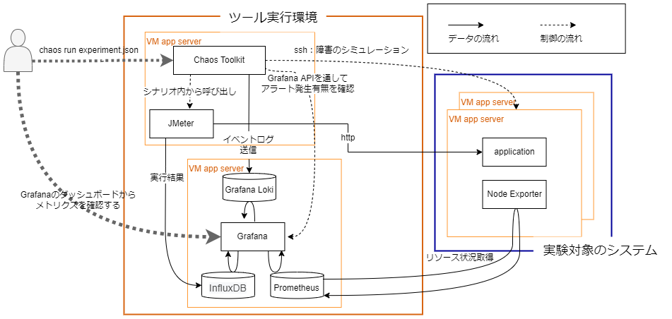

# 障害テストツールガイド

このリポジトリはChaos Toolkitを中心とした障害テスト環境の構築と利用に関するドキュメント群です。

構築する環境のイメージと各ツールの役割は以下の図と表を参照してください。

| ツール名 | 役割 |
|:---|:---|
| [Chaos Toolkit](https://chaostoolkit.org/) | **カオスエンジニアリングツール**   障害テストのシナリオ記述・実行をおこなうために利用します。 |
| [Grafana](https://grafana.com/) |**データ可視化ツール**  Grafana Loki, InfluxDB, Prometheusと連携しメトリクスの可視化をおこなうために利用します。 |
| [Grafana Loki](https://grafana.com/oss/loki/) | **イベントログ収集ツール**   拡張機能の[chaosgrafana](https://chaostoolkit.org/drivers/grafana/)を利用してChaos ToolkitのイベントログをGrafana Lokiに送信し、[annotation](https://grafana.com/docs/grafana/latest/dashboards/annotations/)でGrafanaのグラフ上に表示させることが可能です。 |
| [JMeter](https://jmeter.apache.org/) | **負荷テストツール**   実験対象のシステムに対して任意のトラフィックを作り出すために利用します。実行結果はInfluxDBに送ります。 |
| [InfluxDB](https://www.influxdata.com/) | **時系列データベース**   JMeterの実行結果を蓄積し任意の時間幅でレイテンシやエラー率などを計算するために利用します。   各リクエスト結果を利用した任意の分析をおこなう必要がない場合は[Graphite](https://graphiteapp.org/)でも代用可能です。 |
| [Node Exporter](https://github.com/prometheus/node_exporter) | **サーバ上のメトリクスを収集するツール**   実験対象のシステムのCPUなどのメトリクス情報を取得するために利用します。   [telegraf](https://github.com/influxdata/telegraf)などの類似ツールで代替可能です。 |
| [Prometheus](https://prometheus.io/) | **モニタリングツール**   Node Exporterが取得したメトリクスを収集するために利用します。 |

## 各種利用方法

- [環境構築手順](build_environment.md)
- [障害テスト実行例](run_sample_experiment.md)

## ライセンス

本ソフトウェアは、[Apache 2.0 ライセンス](./LICENSE.txt)の元提供されています。

© 2022 TIS Inc.
