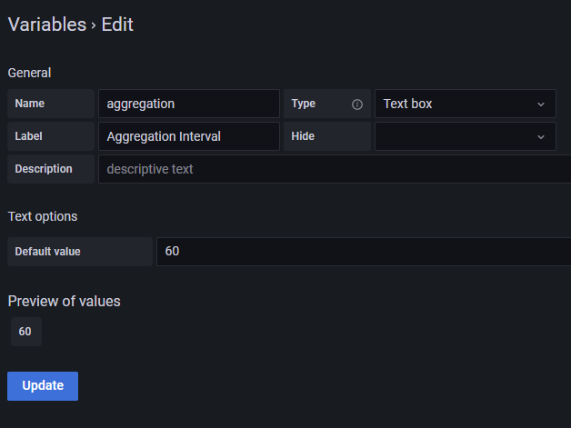
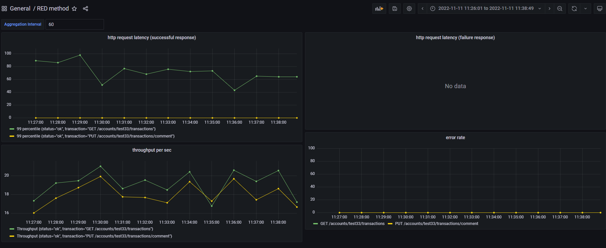

# アプリケーション監視

このドキュメントでは、JMeterシナリオの実行結果をInfluxDBに蓄積し任意の時間幅でレイテンシー、エラー率、スループットを可視化するクエリ例を示します。

## 事前準備

1. GrafanaのUIにアクセスし、既存のダッシュボードもしくは新規作成したダッシュボードを開いてください。
2. ダッシュボードのページから"Dashboard Settings"→"Variables"に移動して、`Variable`を追加します。
3. 以下の画像のように"Type"は`Text box`を選択して、"Name"に`aggregation`、"Label"に`Aggregation Interval`、"Default value"に`60`を入力し、"Update"ボタンを押下してVariableを追加します。

## 可視化クエリサンプル

以下の手順でダッシュボードにパネルを追加して、任意のメトリクスを可視化できます。

1. ダッシュボード画面で"Add Panel"→"Add a new Panel"を選択します。
2. "Data source"に`InfluxDB`を設定して任意のクエリを記入します。

JMeterでのHTTPリクエスト実行結果からリクエストのレイテンシー、エラー率、スループットを可視化する場合は以下のクエリを参考にしてください。

- [成功リクエストのレイテンシー](../influxdb/latency_success.flux)
- [失敗リクエストのレイテンシー](../influxdb/latency_failure.flux)
- [リクエストのエラー率](../influxdb/error_rate.flux)
- [リクエストのスループット](../influxdb/throughput.flux)

以下は可視化後のイメージです。

