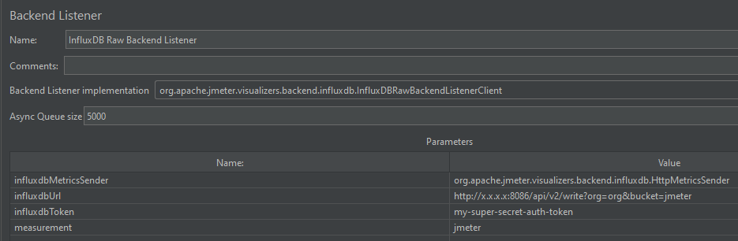

# JMeterとInfluxDBの連携

JMeterのシナリオファイルに[Backend Listener](https://jmeter.apache.org/usermanual/component_reference.html#Backend_Listener)を追加し以下の設定を行ってください。

1. "Backend Listener implementation"に`org.apache.jmeter.visualizers.backend.influxdb.influxDBRawBackendListenerClient`を設定
2. `compose.yaml`で設定した`DOCKER_INFLUXDB_INIT_ORG`と`DOCKER_INFLUXDB_INIT_BUCKET`の値を使って"influxdbUrl"に`http://${ホスト名}:8086/api/v2/write?org=${DOCKER_INFLUXDB_INIT_ORG}&bucket=${DOCKER_INFLUXDB_INIT_BUCKET}`を設定
3. "influxdbToken"に`compose.yaml`で設定した`DOCKER_INFLUXDB_INIT_ADMIN_TOKEN`の値を設定

